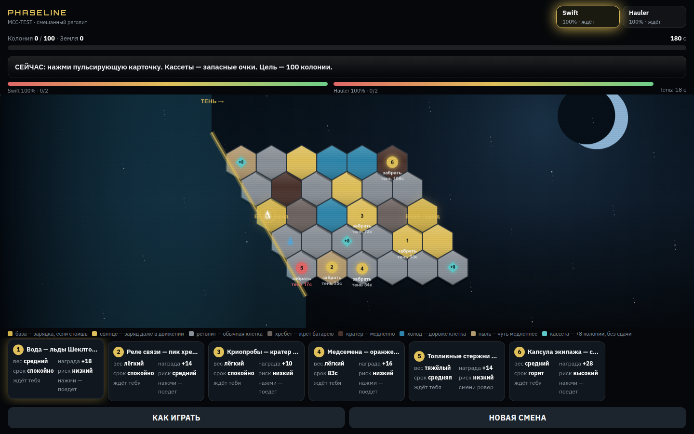
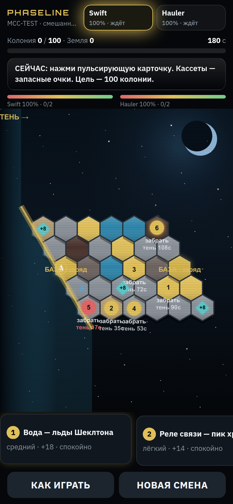
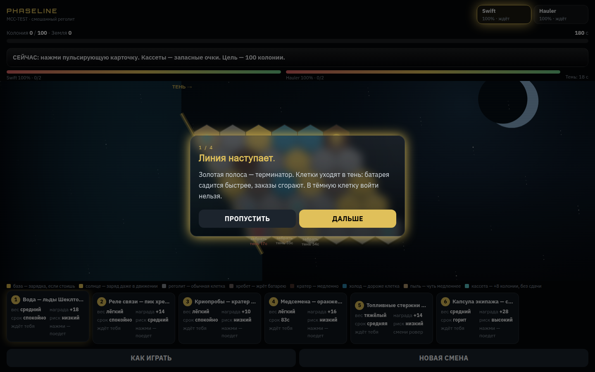

# PHASELINE

Авторская реализация тестового задания **Moon Courier Crisis** из [вакансии](https://docs.google.com/document/d/1t9fOhAPbkDqP0WqGr1We56EqBtXoZbGPVVI5HePcmCs/edit).

Симулятор лунной доставки: гекс-карта, два ровера, заказы с весом и риском, батарея, тень-терминатор, цель смены. Стек: Go + Gin + pgx + sqlc + Postgres + WS + Next + Tailwind + Zustand + TanStack Query + Caddy + Compose.

Репозиторий: https://github.com/bambutcha/phaseline

---

## Как запустить

```bash
docker compose up --build
```

- Игра: http://localhost/
- Health: http://localhost/health
- API (отладка): http://localhost:8080

Тесты симуляции:

```bash
cd apps/api && go test ./...
```

Postgres не публикуется на хост `:5432`, только внутри Compose-сети.

---

## Что сделано

Основной сценарий вакансии:

| Требование | Как сделано |
|---|---|
| Карта Луны | Axial-гексы 6×5, биомы (пояс, хребет, кратеры, пыль, холод) |
| Пины заказов | Номера на карте + карточки снизу |
| Заказ: вес, награда, срочность, риск | Поля контракта в snapshot и UI |
| Ровер: батарея, слоты, статус | Swift и Hauler одновременно |
| Выбрать заказ и ровер, запустить | Клик по карточке / пину / кнопке ровера |
| Postgres | Таблицы `games`, `contracts`, `game_events`, `ghost_runs` |
| Тяжёлый груз влияет на доставку | `WeightMod`, Swift не берёт heavy |
| Отказ, если батареи или слотов мало | Preview того же `Tick`, `reject` |
| Зоны отличаются | Разная стоимость хода |
| Хотя бы одна тяжёлая доставка | Hauler везёт стержни / гелий; Swift их не берёт |
| Счёт обновляется | Colony / Earth после сдачи |
| Цель победы | 100 колонии за ~180 с; пиррова победа если Земля < 40 |

Свои решения поверх ТЗ: тень как стена, triage (всех не спасти), ghost прошлого забега, share `/s/MCC-XXXX`, Black Box, кассеты (+8 колонии без сдачи).

---

## Как устроена логика

Сервер — источник правды. Клиент шлёт intent (`goto`, `dispatch`, `select_rover`), не считает батарею сам.

1. `POST /api/v1/games` создаёт детерминированный мир из сида `MCC-XXXX`.
2. WebSocket `/ws/game/:id` тикает симуляцию **10 Гц**.
3. Пакет `apps/api/internal/sim`:
   - терминатор в **axial-координатах**, не в пикселях;
   - A* с учётом тени на момент прибытия;
   - `MoveCost = Base(zone) × WeightMod × TerrainMod`; тень = непроходимо;
   - `Predict` гоняет тот же `Tick` на копии стейта — красный путь, если батареи не хватит;
   - клик по новой клетке **не откатывает** ровер: текущее ребро доезжается, дальше новый путь.
4. Canvas рисует snapshot 60 FPS: позиция на ребре интерполируется, **линия — только оставшийся путь** от ровера вперёд.

Победа считается в конце смены (таймер / карта в тени / оба stranded / нечего везти), не в момент набора 100 очков. Если заказы кончились, остаются бирюзовые кассеты.

---

## Где хранятся данные

PostgreSQL 16, миграции goose, запросы sqlc (без GORM).

| Таблица | Что |
|---|---|
| `games` | сид, статус, счёт, ровер, JSON карты |
| `contracts` | заказы смены |
| `game_events` | лог Black Box (`hex_entered`, `deliver`, `crisis`…) |
| `ghost_runs` | лучший / последний replay по сиду |

Игровой тик в память процесса API. В БД — создание, финал, призрак. Контракт API: `docs/API.md`.

---

## Решения, которые стоит объяснить

- **Next.js на канон-стеке.** Меню, `/play/[id]`, шаринг `/s/[seed]`, HUD в React, карта на Canvas 2D. Браузер не ходит на `:8080` — только через Caddy.
- **Два ровера сразу.** В ТЗ выбор loadout; так быстрее видно разницу Swift/Hauler и слоты.
- **Тень непроходима.** Иначе терминатор — декоративный таймер. Клик по тёмной клетке отклоняется.
- **Уникальные пины забора.** Лёгкий и тяжёлый не стоят на одном гексе.
- **Баланс.** Жадный бот выигрывает меньшинство сидов (`TestGreedyWinRateIsAChallenge`): цель 100, награды урезаны, скорость умеренная.

---

## Как проверяли

- `go test ./...` — тик, тень, уникальные пины, reroute без отката, кассеты, greedy-winrate.
- Playtest через `docker compose up --build`.
- Скриншоты: [desktop](screenshots/desktop.png), [mobile](screenshots/mobile.png), [tutorial](screenshots/tutorial.png).

---

## Скриншоты

- [Рабочий стол](screenshots/desktop.png)
- [Телефон](screenshots/mobile.png) — карточки листаются горизонтально, легенда скрыта
- [Туториал](screenshots/tutorial.png)







---

## Использование AI

Вакансия разрешает AI. Честно:

- **Сгенерировано:** каркас Compose/Caddy, Next/HUD/Canvas, sqlc, черновики текстов.
- **Задано и проверено человеком:** формулы тика, детерминизм сида, правила груза и тени, reroute с фиксацией ребра, кассеты, баланс, тесты, структура README.
- **Инструмент:** Cursor (агент в репозитории). На этапе задания доступы работодателя не использовались.
- **Не использовалось:** LLM в рантайме игры.

---

## Стек и структура

Go, Gin, pgx, sqlc, goose, WebSocket, PostgreSQL 16, Next.js, Tailwind, Zustand, TanStack Query, Canvas 2D, Caddy, Compose.

Без Redis, Kafka, MinIO, GORM, Phaser.

```text
apps/api                    API и server-authoritative sim
apps/api/internal/sim       тик, A*, тень, грузы
apps/web                    Next.js клиент
deploy/Caddyfile            /api /ws /health → api, остальное → web
docs/                       GDD и спецификации
screenshots/                интерфейс
```
